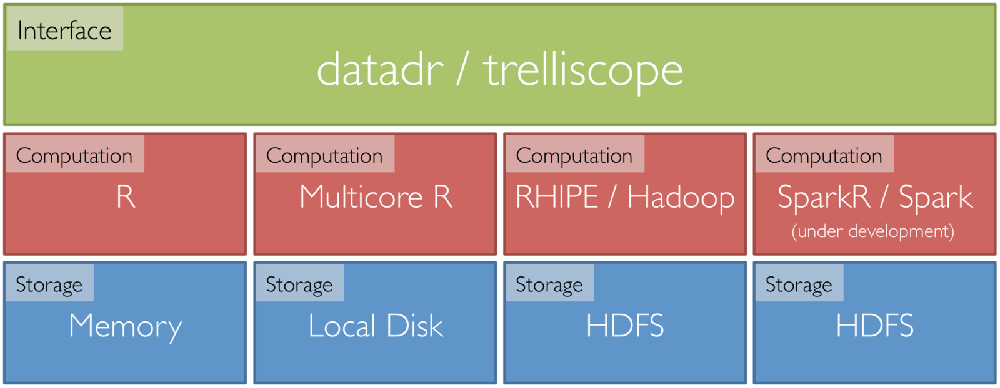

Big data with R 
========================================================
author: Steve Elston
date: March 29, 2016

Big data packages for R
========================================================

Two viable alterntives:

- **[R Hadoop ecosystem:](https://github.com/RevolutionAnalytics/RHadoop/wiki)** rmr2, rhdfs, rhbase, plyrmr, ravro
- **[Tessera ecosystem:](http://tessera.io/)** datadr, trelliscope, Rhipe
- Apply familar R funcitons with both alternatives

Tessera overview
========================================================

Tessera encompases three packages:

- **[datadr:](http://tessera.io/docs-datadr/)** abstracts most divide and recombine operations on map-reduce back-end
- **[trelliscope:](http://tessera.io/docs-trelliscope/)** facilitates visualization of large complex datasets
- **[RHIPE](http://tessera.io/docs-RHIPE/)** provides a backend interface to Hadoop

Tessera stack
========================================================




Distributed R object
========================================================

Distributing data by key-value pairs

- **Distributed data object (ddo)**: values can be any R object, list, etc.
- **Distributed data frame (ddf)** is a ddo containing data frames as the values


Introduction to divide and recombine
========================================================
- Meaningful, persistent divisions of the data
- Analytic or visual methods applied independently to each subset in embarrassingly parallel fashion
- Results are recombined to yield a statistically valid D&R result or visualization


Introduction to divide and recombine
========================================================


Installing datadr
========================================================

Let's give it a try!


```r
## Install the packages and the housing data set from CRAN.
#install.packages("devtools")
#library(devtools)
#options(repos = c(tessera = "http://packages.tessera.io",
#                  getOption("repos")))
install.packages(c("datadr", "trelliscope", "housingData"))
```


Introduction to division
========================================================

- "Big data" is typically big because it is made up of collections of many subsets, sensors, locations, time periods, etc.
- Break the data up based on data structure and apply visual or analytical methods 
- We call this conditioning variable division
- In practice this approach is common and not new
- Another option is random replicate division


Create a distributed data frame with datadr
========================================================

```r
library(datadr)
library(housingData)
housingDdf <- ddf(housing)
```


Examine the distributed data frame
========================================================

```r
housingDdf
```

```

Distributed data frame backed by 'kvMemory' connection

 attribute      | value
----------------+-----------------------------------------------------------
 names          | fips(fac), county(fac), state(fac), time(Dat), and 3 more
 nrow           | 224369
 size (stored)  | 10.58 MB
 size (object)  | 10.58 MB
 # subsets      | 1

* Other attributes: getKeys()
* Missing attributes: splitSizeDistn, splitRowDistn, summary
```


But there are no keys
========================================================

```r
names(housingDdf)
```

```
[1] "fips"             "county"           "state"           
[4] "time"             "nSold"            "medListPriceSqft"
[7] "medSoldPriceSqft"
```

```r
getKeys(housingDdf)
```

```
[[1]]
[1] ""
```


Dividing a dataset with datadr
========================================================

```r
byCounty <- divide(housingDdf, 
                   by = c("county", "state"), 
                   update = TRUE)
```


How many keys are there?

```r
keys <- getKeys(byCounty)
length(keys)
```

```
[1] 2883
```


What are the keys?
========================================================

Example of keys:

```r
firstKey <- keys[[1]]
firstKey
```

```
[1] "county=Abbeville County|state=SC"
```

Look at the names:

```r
names(byCounty)
```

```
[1] "fips"             "time"             "nSold"           
[4] "medListPriceSqft" "medSoldPriceSqft"
```


Look at one key-value pair
========================================================

```r
byCounty[firstKey]
```

```
[[1]]
$key
[1] "county=Abbeville County|state=SC"

$value
   fips       time nSold medListPriceSqft medSoldPriceSqft
1 45001 2008-10-01    NA         73.06226               NA
2 45001 2008-11-01    NA         70.71429               NA
3 45001 2008-12-01    NA         70.71429               NA
4 45001 2009-01-01    NA         73.43750               NA
5 45001 2009-02-01    NA         78.69565               NA
...
```


Summary of the result
========================================================

```r
summary(byCounty)
```

```
        fips                 time                nSold        
 -------------------  ------------------  ------------------- 
       levels : 2883  missing :        0   missing :   164370 
      missing : 0         min : 08-10-01       min :       11 
 > freqTable head <       max : 14-03-01       max :    35619 
 26077 : 140                                  mean : 274.6582 
 51069 : 140                               std dev : 732.2429 
 08019 : 139                              skewness :   10.338 
 13311 : 139                              kurtosis : 222.8995 
 -------------------  ------------------  ------------------- 
   medListPriceSqft     medSoldPriceSqft   
 --------------------  ------------------- 
  missing :     48399   missing :   162770 
      min : 0.5482456       min : 17.40891 
      max :  1544.944       max : 1249.494 
     mean :  96.72912      mean : 105.5659 
  std dev :  56.12035   std dev : 69.40658 
 skewness :  6.816523  skewness : 5.610013 
 kurtosis :  94.06555  kurtosis : 60.48337 
 --------------------  ------------------- 
```


Your turn
========================================================

Try the following:
- Make sure you have opened **port 8100** (uses Shiny)
- Load the datadr and housingData packages
- Create a ddf from housing data frame
- Divide your ddf by some interesting keys
- Examine the keys


A possible solution
========================================================


```r
library(datadr)
library(housingData)
myDdf <- ddf(housing)
myDdf <- divide(myDdf, 
                   by = "time", 
                   update = TRUE)
newKeys <- getKeys(myDdf)
length(newKeys)
```

```
[1] 66
```

```r
newKeys[[1]]
```

```
[1] "time=2008-10-01"
```


Adding a transform to a ddf
========================================================
Create and test a transform function


```r
totalSold <- function(x) {
  sum(x$nSold, na.rm=TRUE)
}
totalSold(byCounty[[20]]$value)
```

```
[1] 14173
```


Apply transform to a ddf
========================================================
Create new ddf with transform and look at a k-v pair

```r
byCountySold <- addTransform(byCounty, totalSold)
byCountySold[[20]]
```

```
$key
[1] "county=Aiken County|state=SC"

$value
[1] 14173
```


Join creates a ddo
========================================================
Join on common keys


```r
byCountyNSold <- drJoin(housing = byCounty, totalSold = byCountySold)
getKeys(byCountyNSold)[[1]]
```

```
[1] "county=Abbeville County|state=SC"
```

Examine the joined ddo
========================================================

```r
byCountyNSold[[20]]$key
```

```
[1] "county=Aiken County|state=SC"
```

```r
byCountyNSold[[20]]$value$totalSold
```

```
[1] 14173
```

```r
byCountyNSold[[20]]$value$housing
```

```
     fips       time nSold medListPriceSqft medSoldPriceSqft
1   45003 2008-10-01   211        100.50287          85.3414
2   45003 2008-11-01   152        100.48913               NA
3   45003 2008-11-01    NA               NA          84.3824
4   45003 2008-12-01   197               NA               NA
5   45003 2008-12-01    NA        101.22699          84.2980
6   45003 2009-01-01   228        101.90736          82.9887
7   45003 2009-02-01   171        101.55889               NA
8   45003 2009-02-01    NA               NA          78.2722
9   45003 2009-03-01   223               NA               NA
10  45003 2009-03-01    NA         99.97500          80.1041
11  45003 2009-04-01   232         99.92593          85.1870
12  45003 2009-05-01   211         99.65517               NA
13  45003 2009-05-01    NA               NA          85.3452
14  45003 2009-06-01   263               NA               NA
15  45003 2009-06-01    NA         98.03922          82.9563
16  45003 2009-07-01   225         97.96034          79.2083
17  45003 2009-08-01   235         97.51258               NA
18  45003 2009-08-01    NA               NA          79.8845
19  45003 2009-09-01   260               NA               NA
20  45003 2009-09-01    NA         96.31519          83.7689
21  45003 2009-10-01   261         96.47137          83.0652
22  45003 2009-11-01   272         96.86985               NA
23  45003 2009-11-01    NA               NA          82.3763
24  45003 2009-12-01   309               NA               NA
25  45003 2009-12-01    NA         96.77419          81.3630
26  45003 2010-01-01   162         96.15385          78.0467
27  45003 2010-02-01   170         96.05556               NA
28  45003 2010-02-01    NA               NA          77.3502
29  45003 2010-03-01   284               NA               NA
30  45003 2010-03-01    NA         94.54958          78.3679
31  45003 2010-04-01   264         94.38889          78.4256
32  45003 2010-05-01   305         94.22222               NA
33  45003 2010-05-01    NA               NA          81.8701
34  45003 2010-06-01   275               NA               NA
35  45003 2010-06-01    NA         95.19048          83.3607
36  45003 2010-07-01   293         94.89451          75.7325
37  45003 2010-08-01   272         94.46618               NA
38  45003 2010-08-01    NA               NA          74.8761
39  45003 2010-09-01   250               NA               NA
40  45003 2010-09-01    NA         93.48791          77.0405
41  45003 2010-10-01   261         92.78351          78.9683
42  45003 2010-11-01   248         92.79082               NA
43  45003 2010-11-01    NA               NA          78.9997
44  45003 2010-12-01   278               NA               NA
45  45003 2010-12-01    NA         92.66129          77.3464
46  45003 2011-01-01   164         92.35669          74.0363
47  45003 2011-02-01   156         91.38889               NA
48  45003 2011-02-01    NA               NA          71.5457
49  45003 2011-03-01   197               NA               NA
50  45003 2011-03-01    NA         92.44186          72.1705
51  45003 2011-04-01   180         93.22866          73.8384
52  45003 2011-05-01   195         94.65909               NA
53  45003 2011-05-01    NA               NA          78.5870
54  45003 2011-06-01   232               NA               NA
55  45003 2011-06-01    NA         93.97106          80.3465
56  45003 2011-07-01   200         91.58790          79.7257
57  45003 2011-08-01   211               NA               NA
58  45003 2011-08-01    NA         93.75000          77.7444
59  45003 2011-09-01   184               NA               NA
60  45003 2011-09-01    NA         92.53472          75.5611
61  45003 2011-10-01   200         92.70270          78.2794
62  45003 2011-11-01   168               NA               NA
63  45003 2011-11-01    NA         89.51841          73.6117
64  45003 2011-12-01   217               NA               NA
65  45003 2011-12-01    NA         89.93453          70.8109
66  45003 2012-01-01   168         88.19199          71.3458
67  45003 2012-02-01   196               NA               NA
68  45003 2012-02-01    NA         88.65248          70.7194
69  45003 2012-03-01   248               NA               NA
70  45003 2012-03-01    NA         89.65854          72.7065
71  45003 2012-04-01   239         88.18898          73.0498
72  45003 2012-05-01   256               NA               NA
73  45003 2012-05-01    NA         90.37071          75.9885
74  45003 2012-06-01   212               NA               NA
75  45003 2012-06-01    NA         90.09901          80.1762
76  45003 2012-07-01   257         89.49105          78.1591
77  45003 2012-08-01   232               NA               NA
78  45003 2012-08-01    NA         88.14103          77.4551
79  45003 2012-09-01   199               NA               NA
80  45003 2012-09-01    NA         87.74574          76.6112
81  45003 2012-10-01   255         87.46499          75.8169
82  45003 2012-11-01   192               NA               NA
83  45003 2012-11-01    NA         87.91143          76.6253
84  45003 2012-12-01   215               NA               NA
85  45003 2012-12-01    NA         87.82395          77.7349
86  45003 2013-01-01   193         87.85942          70.5285
87  45003 2013-02-01   192               NA               NA
88  45003 2013-02-01    NA         87.11041          73.5696
89  45003 2013-03-01   244               NA               NA
90  45003 2013-03-01    NA         87.57732          73.8856
91  45003 2013-04-01   263         87.94501          76.8654
92  45003 2013-05-01   291               NA               NA
93  45003 2013-05-01    NA         88.07692          77.2330
94  45003 2013-06-01   252               NA               NA
95  45003 2013-06-01    NA         88.54167          79.4398
96  45003 2013-07-01   253         87.50000          76.9809
97  45003 2013-08-01   300               NA               NA
98  45003 2013-08-01    NA         87.72321          77.8354
99  45003 2013-09-01   264               NA               NA
100 45003 2013-09-01    NA         88.23529          77.0270
101 45003 2013-10-01   240         88.34951          74.5346
102 45003 2013-11-01   196               NA               NA
103 45003 2013-11-01    NA         87.32517          73.8844
104 45003 2013-12-01    NA         87.89062          71.6236
105 45003 2014-01-01    NA         87.15980          71.2240
106 45003 2014-02-01    NA         87.70732          72.0306
107 45003 2014-03-01    NA         88.38748          75.3452
```

Your turn!
========================================================
Apply a transform to your ddf

- Create a function to compute a summary statistic
- Test your function on a subset of your ddf
- Apply your function as a transform to your ddf
- Examine the results


A possible solution, part 1
========================================================
Create and test the function

```r
priceDiff <- function(x){
  mean(x$medSoldPriceSqft - x$medListPriceSqft, na.rm = TRUE)
  }
priceDiff(myDdf[[1]]$value)
```

```
[1] -9.045783
```


A possible solution, part 2
========================================================
Apply the transformation

```r
diffByMonth <- addTransform(myDdf, priceDiff)
class(diffByMonth)
```

```
[1] "transformed" "ddo"         "kvMemory"   
```

```r
diffByMonth[[1]]
```

```
$key
[1] "time=2008-10-01"

$value
[1] -9.045783
```


Review
========================================================
Handle large data sets by dividing into key-value pairs
- Keys index the data chunks
- Data chunks are the values
- k-v pairs can be ddo or ddf

Transform data with addTransform
- Most any R function
- Uses lazy evaluation


Some datadr functions for divisions
========================================================
- **drLapply():** apply a function to each subset of a ddo/ddf and obtain a new ddo/ddf
- **drSample():** take a random sample of subsets of a ddo/ddf
- **drFilter():** filter out subsets of a ddo/ddf that meet a specified criteria
- **drSubset():** return a subset data frame of a ddf
- **drRead.table()** and friends
- **mrExec():** run a traditional MapReduce job on a ddo/ddf


Division independent datadr methods
========================================================
- **drQuantile():** estimate all-data quantiles, optionally by a grouping variable
- **drAggregate():** all-data tabulation
- **drHexbin():** all-data hexagonal binning aggregation
- **summary()** method computes numerically stable moments, other summary stats 


Analytic recombination
========================================================
What is the class of the object created with the transform?


```r
class(byCountySold)
```

```
[1] "transformed" "ddo"         "kvMemory"   
```


Analytic recombination
========================================================
The *combine* parameter of the *recombine* function controls the form of the result
- **combine=combRbind:** combines all transformed key-value pairs into a local data frame - frequently used
- **combine=combCollect:** transformed key-value pairs are collected into a local list in your R session
- **combine=combDdo:** results are combined into a new ddo object
- **combMeanCoef:** computes the mean of model coefficients
- Others can be written for more sophisticated goals, such as, combining models, etc.


Analytic recombination example
========================================================
Apply recombine to the ddo

```r
nSold <- recombine(byCountySold,
                   combine=combRbind)
```

The result is a simple local dataframe

```r
class(nSold)
```

```
[1] "data.frame"
```

```r
names(nSold)
```

```
[1] "county" "state"  "val"   
```


Your turn!
========================================================
- Start with the result of the last exercice
- Examine the classs
- Recombine the results
- Examine the properties of the recombined results

A posible solution, Part 1
========================================================
Class of transformation result

```r
class(diffByMonth)
```

```
[1] "transformed" "ddo"         "kvMemory"   
```

Recombine the results

```r
diffByMonthdf <- recombine(diffByMonth,
                   combine=combRbind)
```


A posible solution, Part 2
========================================================
The class of the recombined result

```r
class(diffByMonthdf)
```

```
[1] "data.frame"
```

The columns of the local data frame

```r
names(diffByMonthdf)
```

```
[1] "time" "val" 
```


Visualization of large complex data sets
========================================================
Use Trelliscope for visual recombination
- Trelliscope is specifically designed to visualize large complex datasets
- Trelliscope visualizes k-v pairs
- Displays are conditioned by keys
- Trelliscope stores its displays in a "Visualization Database" (VDB), a collection of files on your disk containing metadata about the displays

Setup for trelliscope
========================================================
To create and view displays, establish a connection to the VDB


```r
library(trelliscope)
# establish a connection to a VDB located in a directory "housing_vdb"
conn <- vdbConn("housing_vdb", autoYes = TRUE)
conn
```

```
vdb connection object: "strata"; path=C:\Users\Steve\Dropbox\Oreilly\Big Data with R\Strata 2016\housing_vdb
```
- If initialized, it simply makes the connection


Creating a trelliscope display
========================================================
A Trelliscope display is created with the ```makeDisplay()``` function with minimum specification of:
- data: a ddo or ddf input data set
- name: the name of the display
- panelFn: a function that operates on the value of each key-value pair and produces a plot


Recall our data set
========================================================


```r
class(byCountyNSold)
```

```
[1] "ddo"      "kvMemory"
```

```r
byCountyNSold[[20]]
```

```
$key
[1] "county=Aiken County|state=SC"

$value
$housing
     fips       time nSold medListPriceSqft medSoldPriceSqft
1   45003 2008-10-01   211        100.50287          85.3414
2   45003 2008-11-01   152        100.48913               NA
3   45003 2008-11-01    NA               NA          84.3824
4   45003 2008-12-01   197               NA               NA
5   45003 2008-12-01    NA        101.22699          84.2980
6   45003 2009-01-01   228        101.90736          82.9887
7   45003 2009-02-01   171        101.55889               NA
8   45003 2009-02-01    NA               NA          78.2722
9   45003 2009-03-01   223               NA               NA
10  45003 2009-03-01    NA         99.97500          80.1041
11  45003 2009-04-01   232         99.92593          85.1870
12  45003 2009-05-01   211         99.65517               NA
13  45003 2009-05-01    NA               NA          85.3452
14  45003 2009-06-01   263               NA               NA
15  45003 2009-06-01    NA         98.03922          82.9563
16  45003 2009-07-01   225         97.96034          79.2083
17  45003 2009-08-01   235         97.51258               NA
18  45003 2009-08-01    NA               NA          79.8845
19  45003 2009-09-01   260               NA               NA
20  45003 2009-09-01    NA         96.31519          83.7689
21  45003 2009-10-01   261         96.47137          83.0652
22  45003 2009-11-01   272         96.86985               NA
23  45003 2009-11-01    NA               NA          82.3763
24  45003 2009-12-01   309               NA               NA
25  45003 2009-12-01    NA         96.77419          81.3630
26  45003 2010-01-01   162         96.15385          78.0467
27  45003 2010-02-01   170         96.05556               NA
28  45003 2010-02-01    NA               NA          77.3502
29  45003 2010-03-01   284               NA               NA
30  45003 2010-03-01    NA         94.54958          78.3679
31  45003 2010-04-01   264         94.38889          78.4256
32  45003 2010-05-01   305         94.22222               NA
33  45003 2010-05-01    NA               NA          81.8701
34  45003 2010-06-01   275               NA               NA
35  45003 2010-06-01    NA         95.19048          83.3607
36  45003 2010-07-01   293         94.89451          75.7325
37  45003 2010-08-01   272         94.46618               NA
38  45003 2010-08-01    NA               NA          74.8761
39  45003 2010-09-01   250               NA               NA
40  45003 2010-09-01    NA         93.48791          77.0405
41  45003 2010-10-01   261         92.78351          78.9683
42  45003 2010-11-01   248         92.79082               NA
43  45003 2010-11-01    NA               NA          78.9997
44  45003 2010-12-01   278               NA               NA
45  45003 2010-12-01    NA         92.66129          77.3464
46  45003 2011-01-01   164         92.35669          74.0363
47  45003 2011-02-01   156         91.38889               NA
48  45003 2011-02-01    NA               NA          71.5457
49  45003 2011-03-01   197               NA               NA
50  45003 2011-03-01    NA         92.44186          72.1705
51  45003 2011-04-01   180         93.22866          73.8384
52  45003 2011-05-01   195         94.65909               NA
53  45003 2011-05-01    NA               NA          78.5870
54  45003 2011-06-01   232               NA               NA
55  45003 2011-06-01    NA         93.97106          80.3465
56  45003 2011-07-01   200         91.58790          79.7257
57  45003 2011-08-01   211               NA               NA
58  45003 2011-08-01    NA         93.75000          77.7444
59  45003 2011-09-01   184               NA               NA
60  45003 2011-09-01    NA         92.53472          75.5611
61  45003 2011-10-01   200         92.70270          78.2794
62  45003 2011-11-01   168               NA               NA
63  45003 2011-11-01    NA         89.51841          73.6117
64  45003 2011-12-01   217               NA               NA
65  45003 2011-12-01    NA         89.93453          70.8109
66  45003 2012-01-01   168         88.19199          71.3458
67  45003 2012-02-01   196               NA               NA
68  45003 2012-02-01    NA         88.65248          70.7194
69  45003 2012-03-01   248               NA               NA
70  45003 2012-03-01    NA         89.65854          72.7065
71  45003 2012-04-01   239         88.18898          73.0498
72  45003 2012-05-01   256               NA               NA
73  45003 2012-05-01    NA         90.37071          75.9885
74  45003 2012-06-01   212               NA               NA
75  45003 2012-06-01    NA         90.09901          80.1762
76  45003 2012-07-01   257         89.49105          78.1591
77  45003 2012-08-01   232               NA               NA
78  45003 2012-08-01    NA         88.14103          77.4551
79  45003 2012-09-01   199               NA               NA
80  45003 2012-09-01    NA         87.74574          76.6112
81  45003 2012-10-01   255         87.46499          75.8169
82  45003 2012-11-01   192               NA               NA
83  45003 2012-11-01    NA         87.91143          76.6253
84  45003 2012-12-01   215               NA               NA
85  45003 2012-12-01    NA         87.82395          77.7349
86  45003 2013-01-01   193         87.85942          70.5285
87  45003 2013-02-01   192               NA               NA
88  45003 2013-02-01    NA         87.11041          73.5696
89  45003 2013-03-01   244               NA               NA
90  45003 2013-03-01    NA         87.57732          73.8856
91  45003 2013-04-01   263         87.94501          76.8654
92  45003 2013-05-01   291               NA               NA
93  45003 2013-05-01    NA         88.07692          77.2330
94  45003 2013-06-01   252               NA               NA
95  45003 2013-06-01    NA         88.54167          79.4398
96  45003 2013-07-01   253         87.50000          76.9809
97  45003 2013-08-01   300               NA               NA
98  45003 2013-08-01    NA         87.72321          77.8354
99  45003 2013-09-01   264               NA               NA
100 45003 2013-09-01    NA         88.23529          77.0270
101 45003 2013-10-01   240         88.34951          74.5346
102 45003 2013-11-01   196               NA               NA
103 45003 2013-11-01    NA         87.32517          73.8844
104 45003 2013-12-01    NA         87.89062          71.6236
105 45003 2014-01-01    NA         87.15980          71.2240
106 45003 2014-02-01    NA         87.70732          72.0306
107 45003 2014-03-01    NA         88.38748          75.3452

$totalSold
[1] 14173
```


Define a panel function
========================================================
Use ggplot2 to create a panel function

```r
saleSoldPannel <- function(xx){
  yy <- xx$housing
  ggplot(yy) + 
    geom_point(aes(time, medListPriceSqft)) +
    geom_point(aes(time, medSoldPriceSqft), color = "red", shape = 17) 
}
```


Test the panel function
========================================================
Use ggplot2 to create a panel function

```r
saleSoldPannel(byCountyNSold[[1]]$value)
```

 

Make the trelliscope display
========================================================


```r
makeDisplay(byCountyNSold,
            name = "Strata",
            desc = "List and sold price over time",
            panelFn = saleSoldPannel, 
            width = 400, height = 400
)
```


How to sort a massive number of charts?
========================================================
"There seems no escape from asking the computer to sort out the displays to be displayed… To do this, the computer must judge the relative different displays, the relative importance of showing them. This means calculating some “diagnostic quantities.” … It seems natural to call such computer guiding diagnostics “cognostics”. We must learn to choose them, calculate them, and use them. Else we drown in a sea of many different displays."  John W. Tukey


Cognositics with Trelliscope
========================================================
Cognostic function supplies guideance for visualization
- Cognostic function takes a subset of the data as input and returns a named list of cognostics
- **cog()** function can supply additional attributes like descriptions to help the viewer
- **cogMean** provides cognostic based on mean
- **cogRange** provides cognostic based on range
- **cogHref** creates href cognostic 


Create a cognostic function
========================================================


```r
zillowCog <- function(x) {
  # return a list of cognostics
  list(
    meanList = cogMean(x$housing$medListPriceSqft),
    meanSold = cogMean(x$housing$medSoldPriceSqft),
    totalSold = cog(x$totalSold, desc = "Total sold")
  )
}
```


Make the trelliscope display with cognostic
========================================================


```r
makeDisplay(byCountyNSold,
             name = "Strata cognostics",
             desc = "List and sold price over time",
             panelFn = saleSoldPannel,
             cogFn = zillowCog,
             width = 400, height = 400
 )
```


Your turn!
========================================================
Extend and test the cognostic function
- Create, test and apply a new transform (optional)
- Join the resulting statistic to the ddo
- Add the statistic to the cognostic function

**Or**, use one of the cognositc built in functions


A possible solution, part 1
========================================================


```r
priceDiff <- function(x){
  y <- x$housing
  mean(y$medSoldPriceSqft - y$medListPriceSqft, na.rm = TRUE)
  }
meanDiff <- addTransform(byCountyNSold, priceDiff)
byCountyDiff <- drJoin(housing = byCounty, totalSold = byCountySold, 
                       meanDiff = meanDiff)
```


A possible solution, part 2
========================================================

```r
zillowCog2 <- function(x) {
  # return a list of cognostics
  list(
    meanList = cogMean(x$housing$medListPriceSqft),
    meanSold = cogMean(x$housing$medSoldPriceSqft),
    totalSold = cog(x$totalSold, desc = "Total sold"),
    meanDiff = cog(x$meanDiff, desc = "Mean sold-list price difference")
  )
}
```


A possible solution, part 3
========================================================


```r
makeDisplay(byCountyDiff,
             name = "Strata cognostics 2",
             desc = "List and sold price over time 2",
             panelFn = saleSoldPannel,
             cogFn = zillowCog2,
             width = 400, height = 400
 )
```


Review
========================================================
Divide and recombine for large complex data sets
- Division gives manageable sized data chunks
- Division by keys into key-value pairs
- Recombination can be analytic or visualization
- Trelliscope enables large scale exploration of data
- Cognostics used for computer guided visualization


Scaling up
========================================================
Medium data sets can use multi-core and local disk connection

```r
require(parallel)
options(defaultLocalDiskControl = localDiskControl(makeCluster(2)))
strataDiskConn <- localDiskConn(file.path(tempdir(), "strataKV"), autoYes = TRUE)
strataDiskConn
```

```
localDiskConn connection
  loc=C:\Users\Steve\AppData\Local\Temp\Rtmp4O9MB5\strataKV; nBins=0
```


Adding data to local disk connection
========================================================


```r
len <- dim(housing)[1]
indx1 <- as.integer(len/2)
indx2 <- indx1 + 1
housingList <- kvPairs(
    list('key1', housing[1:indx1, ]),
    list('key2', housing[indx2:len, ])
  )
addData(strataDiskConn, housingList, overwrite = TRUE)
list.files(strataDiskConn$loc)
```

```
[1] "_meta"                                 
[2] "07abaecdababc84098369b43ae953523.Rdata"
[3] "b1f1dba2f126bc3208b6b84121503757.Rdata"
```


Create a ddf on disk
========================================================


```r
housingDdfDisk <- ddf(strataDiskConn, update = TRUE)
housingDdfDisk
```

```

Distributed data frame backed by 'kvLocalDisk' connection

 attribute      | value
----------------+-----------------------------------------------------------
 names          | fips(fac), county(fac), state(fac), time(Dat), and 3 more
 nrow           | 224369
 size (stored)  | 1.98 MB
 size (object)  | 10.88 MB
 # subsets      | 2

* Other attributes: getKeys(), splitSizeDistn(), splitRowDistn(), summary()
```


Create a new local disk connection
========================================================


```r
byCountyDiskConn <- localDiskConn(file.path(tempdir(), "byCounty"), autoYes = TRUE)
byCountyDiskConn
```

```
localDiskConn connection
  loc=C:\Users\Steve\AppData\Local\Temp\Rtmp4O9MB5\byCounty; nBins=0
```


Divide the on-disk ddf
========================================================


```r
byCountyDisk <- divide(housingDdfDisk,
                   by = c("county", "state"), 
                   output = byCountyDiskConn,
                   update = TRUE, overwrite = TRUE)
byCountyDisk
```

```

Distributed data frame backed by 'kvLocalDisk' connection

 attribute      | value
----------------+-----------------------------------------------------------
 names          | fips(cha), time(Dat), nSold(num), and 2 more
 nrow           | 224369
 size (stored)  | 3.13 MB
 size (object)  | 15.21 MB
 # subsets      | 2883

* Other attributes: getKeys(), splitSizeDistn(), splitRowDistn(), summary()
* Conditioning variables: county, state
```


Try it with Hadoop
========================================================
Install instructions available for AWS and Azure

- **[For EMR](https://github.com/tesseradata/install-emr)**
- **[For HDInsight](https://github.com/tesseradata/install-hdinsight)**


Your turn!
========================================================
Perhaps as homework try the following:
- Create an on-disk ddo
- Try dividing by keys
- Apply a transform or visualize with Trelliscope


Summary
========================================================
- Divide into meaningful, persistent divisions of the data
- Analytic or visual methods applied independently to each subset in embarrassingly parallel fashion
- Results are recombined to yield a statistically valid D&R result or visualization
- Scale with multi-core and disk connection or HDFS connection on Hadoop cluster
